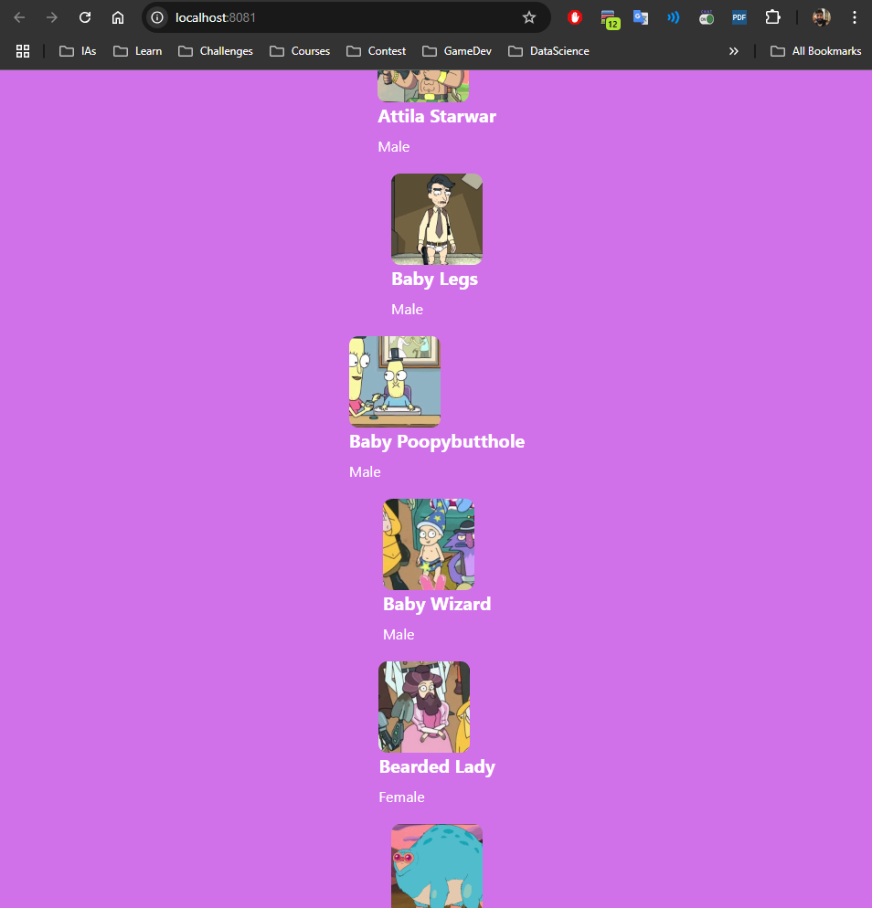

# React Native Projects

This repository focuses on learning React Native, a new technology I want to explore for future use.

## Project 1 - Images Scroll
A simple image scrolling app built with React Native, designed to work across multiple platforms such as Android, iOS, and web.

* The image data and related information are sourced from the [RickyAndMortyAPI](https://rickandmortyapi.com/documentation/#rest).
* I followed this tutorial as a reference, though this project is not identical to it: [REACT NATIVE para Principiantes](https://www.youtube.com/watch?v=U23lNFm_J70)

### Current state of the project

## Upcoming Projects